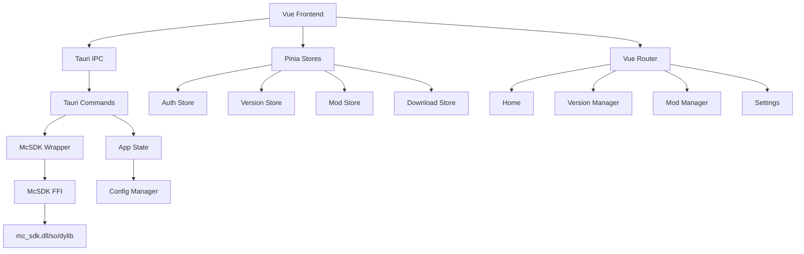

# MoLaunch 开发蓝图 (Development Blueprint)

> **版本**: v1.0.0
> **更新日期**: 2026-06-26
> **维护者**: MoLaunch Team

---

## 目录

1. [项目架构总览](#1-项目架构总览)
2. [技术栈详解](#2-技术栈详解)
3. [模块依赖关系图](#3-模块依赖关系图)
4. [核心数据结构定义](#4-核心数据结构定义)
5. [UI 设计规范](#5-ui-设计规范)
6. [状态管理策略](#6-状态管理策略)
7. [Tauri 命令层设计](#7-tauri-命令层设计)
8. [测试策略](#8-测试策略)
9. [分阶段实现计划](#9-分阶段实现计划)

---

## 1. 项目架构总览

### 1.1 目录结构

```
MoLaunch/
├── src-tauri/                    # Rust 后端
│   ├── src/
│   │   ├── main.rs               # Tauri 入口
│   │   ├── lib.rs                # 库入口
│   │   ├── sdk/                  # McSDK FFI 绑定层
│   │   │   ├── mod.rs
│   │   │   ├── bindings.rs       # FFI 类型定义
│   │   │   ├── wrapper.rs        # Rust 封装
│   │   │   └── error.rs          # 错误处理
│   │   ├── commands/             # Tauri 命令层
│   │   │   ├── mod.rs
│   │   │   ├── auth.rs           # 认证命令
│   │   │   ├── version.rs        # 版本管理命令
│   │   │   ├── mod_cmd.rs        # Mod 管理命令
│   │   │   ├── skin.rs           # 皮肤管理命令
│   │   │   ├── java.rs           # Java 管理命令
│   │   │   ├── download.rs       # 下载命令
│   │   │   └── settings.rs       # 设置命令
│   │   ├── state/                # 应用状态
│   │   │   ├── mod.rs
│   │   │   ├── app.rs            # 全局状态
│   │   │   └── config.rs         # 配置管理
│   │   └── utils/                # 工具函数
│   │       ├── mod.rs
│   │       ├── path.rs           # 路径处理
│   │       └── platform.rs       # 平台检测
│   ├── Cargo.toml
│   └── tauri.conf.json
│
├── src/                          # Vue 前端
│   ├── main.ts                   # 应用入口
│   ├── App.vue                   # 根组件
│   ├── components/               # 通用组件
│   │   ├── layout/               # 布局组件
│   │   │   ├── Sidebar.vue       # 侧边栏
│   │   │   ├── Header.vue        # 顶部栏
│   │   │   └── MainContent.vue   # 主内容区
│   │   ├── auth/                 # 认证组件
│   │   │   ├── LoginForm.vue     # 登录表单
│   │   │   └── DeviceCode.vue    # 设备码显示
│   │   ├── version/              # 版本组件
│   │   │   ├── VersionList.vue   # 版本列表
│   │   │   └── VersionCard.vue   # 版本卡片
│   │   ├── mod/                  # Mod 组件
│   │   │   ├── ModList.vue       # Mod 列表
│   │   │   ├── ModCard.vue       # Mod 卡片
│   │   │   └── ModSearch.vue     # Mod 搜索
│   │   ├── common/               # 通用组件
│   │   │   ├── Button.vue        # 按钮
│   │   │   ├── Input.vue         # 输入框
│   │   │   ├── Modal.vue         # 弹窗
│   │   │   ├── Progress.vue      # 进度条
│   │   │   └── Toast.vue         # 提示
│   │   └── download/             # 下载组件
│   │       ├── DownloadList.vue  # 下载列表
│   │       └── DownloadItem.vue  # 下载项
│   ├── views/                    # 页面视图
│   │   ├── Home.vue              # 首页
│   │   ├── VersionManager.vue    # 版本管理
│   │   ├── ModManager.vue        # Mod 管理
│   │   ├── SkinManager.vue       # 皮肤管理
│   │   ├── ServerList.vue        # 服务器列表
│   │   ├── Settings.vue          # 设置
│   │   └── InstanceManager.vue   # 实例管理
│   ├── stores/                   # Pinia 状态管理
│   │   ├── auth.ts               # 认证状态
│   │   ├── version.ts            # 版本状态
│   │   ├── mod.ts                # Mod 状态
│   │   ├── download.ts           # 下载状态
│   │   ├── settings.ts           # 设置状态
│   │   └── instance.ts           # 实例状态
│   ├── composables/              # 组合式函数
│   │   ├── useAuth.ts            # 认证逻辑
│   │   ├── useVersion.ts         # 版本逻辑
│   │   ├── useDownload.ts        # 下载逻辑
│   │   └── useTheme.ts           # 主题逻辑
│   ├── router/                   # 路由配置
│   │   └── index.ts
│   ├── types/                    # TypeScript 类型
│   │   ├── auth.ts
│   │   ├── version.ts
│   │   ├── mod.ts
│   │   └── api.ts
│   ├── utils/                    # 工具函数
│   │   ├── tauri.ts              # Tauri API 封装
│   │   └── format.ts             # 格式化工具
│   └── assets/                   # 静态资源
│       ├── styles/               # 样式文件
│       │   ├── main.css
│       │   └── themes/           # 主题文件
│       └── images/               # 图片资源
│
├── sdk_data/                     # McSDK 动态库
│   ├── mc_sdk-windows-x86_64.dll
│   ├── mc_sdk-macos-aarch64.dylib
│   ├── mc_sdk-macos-x86_64.dylib
│   ├── mc_sdk-linux-x86_64.so
│   └── mc_sdk.h
│
├── public/                       # 公共静态资源
├── package.json
├── tsconfig.json
├── vite.config.ts
├── tailwind.config.js
├── CHANGELOG.md
├── AI_AGENT_GUIDELINES.md
├── DEVELOPMENT_BLUEPRINT.md
├── DEVELOPMENT_GUIDELINES.md
└── README.md
```

### 1.2 模块职责划分

| 模块 | 职责 | 技术栈 |
|------|------|--------|
| `sdk` | McSDK FFI 绑定，类型转换 | Rust |
| `commands` | Tauri 命令，业务逻辑 | Rust |
| `state` | 应用状态管理 | Rust |
| `components` | UI 组件库 | Vue 3 + TypeScript |
| `views` | 页面视图 | Vue 3 + TypeScript |
| `stores` | 前端状态管理 | Pinia |
| `composables` | 可复用逻辑 | Vue 3 Composition API |

---

## 2. 技术栈详解

### 2.1 前端技术栈

| 技术 | 版本 | 用途 |
|------|------|------|
| Vue 3 | ^3.4 | 前端框架 |
| TypeScript | ^5.3 | 类型系统 |
| Vite | ^5.0 | 构建工具 |
| Pinia | ^2.1 | 状态管理 |
| Vue Router | ^4.2 | 路由管理 |
| Headless UI | ^1.7 | 无样式组件 |
| Tailwind CSS | ^3.4 | 样式框架 |
| Framer Motion | ^11.0 | 动画库 |

### 2.2 后端技术栈

| 技术 | 版本 | 用途 |
|------|------|------|
| Tauri | ^1.7 | 桌面应用框架 |
| Rust | ^1.75 | 后端语言 |
| Tokio | ^1.35 | 异步运行时 |
| McSDK | ^0.1.7 | Minecraft SDK |

### 2.3 开发工具

| 工具 | 用途 |
|------|------|
| ESLint | 前端代码检查 |
| Prettier | 前端代码格式化 |
| Clippy | Rust 代码检查 |
| rustfmt | Rust 代码格式化 |

---

## 3. 模块依赖关系图



---

## 4. 核心数据结构定义

### 4.1 认证相关类型

```typescript
// src/types/auth.ts

/** 认证类型 */
export enum AuthType {
  Microsoft = 0,
  Offline = 1,
  External = 2,
}

/** 认证结果 */
export interface AuthResult {
  auth_type: AuthType
  access_token: string
  refresh_token?: string
  uuid: string
  username: string
  expires_at: number
  error_code: number
  error_message?: string
}

/** 设备码信息 */
export interface DeviceCode {
  device_code: string
  user_code: string
  verification_uri: string
  verification_uri_complete?: string
  expires_in: number
  interval: number
}

/** 登录状态 */
export type LoginStatus = 'idle' | 'loading' | 'success' | 'error'
```

### 4.2 版本相关类型

```typescript
// src/types/version.ts

/** 版本类型 */
export type VersionType = 'release' | 'snapshot' | 'old_beta' | 'old_alpha'

/** 版本信息 */
export interface VersionInfo {
  id: string
  version_type: VersionType
  release_time: number
}

/** 版本列表 */
export interface VersionList {
  versions: VersionInfo[]
  latest_release: string
  latest_snapshot: string
}

/** 已安装版本 */
export interface InstalledVersion {
  id: string
  version_type: VersionType
  installed_at: string
  has_forge: boolean
  has_fabric: boolean
  has_neoforge: boolean
}

/** 加载器类型 */
export type LoaderType = 'vanilla' | 'forge' | 'fabric' | 'neoforge' | 'optifine' | 'liteloader'

/** 加载器版本 */
export interface LoaderVersion {
  loader: LoaderType
  version: string
  mc_version: string
}
```

### 4.3 Mod 相关类型

```typescript
// src/types/mod.ts

/** Mod 信息 */
export interface ModInfo {
  id: string
  name: string
  version: string
  description?: string
  authors?: string[]
  file_path: string
  enabled: boolean
}

/** Mod 搜索结果 (CurseForge) */
export interface CurseForgeSearchResult {
  id: number
  name: string
  summary: string
  download_count: number
  categories: string[]
  authors: string[]
  logo_url?: string
}

/** Mod 搜索结果 (Modrinth) */
export interface ModrinthSearchResult {
  project_id: string
  title: string
  description: string
  downloads: number
  icon_url?: string
  author: string
  categories: string[]
  versions: string[]
}

/** 搜索平台 */
export type SearchPlatform = 'curseforge' | 'modrinth'
```

### 4.4 下载相关类型

```typescript
// src/types/download.ts

/** 下载阶段 */
export type DownloadStage = 
  | 'version_manifest'
  | 'version_json'
  | 'client_jar'
  | 'libraries'
  | 'assets'
  | 'natives'

/** 下载进度 */
export interface DownloadProgress {
  stage: DownloadStage
  current: number
  total: number
  percentage: number
  speed: number // bytes per second
  eta: number // seconds
}

/** 下载任务 */
export interface DownloadTask {
  id: string
  version_id: string
  status: 'pending' | 'downloading' | 'completed' | 'failed'
  progress: DownloadProgress
  error?: string
}
```

### 4.5 设置相关类型

```typescript
// src/types/settings.ts

/** 应用设置 */
export interface AppSettings {
  game_dir: string
  max_download_threads: number
  mirror_url?: string
  log_level: number
  java_path?: string
  min_memory: number
  max_memory: number
  theme: Theme
  language: Language
  curseforge_api_key?: string
}

/** 主题类型 */
export type Theme = 'light' | 'dark' | 'system'

/** 语言类型 */
export type Language = 'zh-CN' | 'en-US'

/** 实例配置 */
export interface InstanceConfig {
  id: string
  name: string
  version_id: string
  loader: LoaderType
  loader_version?: string
  game_dir: string
  java_path?: string
  min_memory: number
  max_memory: number
  created_at: string
}
```

### 4.6 Rust 端数据结构

```rust
// src-tauri/src/state/app.rs

use std::sync::Arc;
use tokio::sync::Mutex;
use crate::sdk::wrapper::McSdk;

/// 应用全局状态
pub struct AppState {
    pub sdk: Arc<Mutex<McSdk>>,
    pub config: Arc<Mutex<AppConfig>>,
    pub auth: Arc<Mutex<AuthState>>,
}

/// 应用配置
pub struct AppConfig {
    pub game_dir: String,
    pub max_download_threads: u32,
    pub mirror_url: Option<String>,
    pub log_level: u32,
    pub curseforge_api_key: Option<String>,
}

/// 认证状态
pub struct AuthState {
    pub current_user: Option<AuthResult>,
    pub device_id: String,
}
```

---

## 5. UI 设计规范

### 5.1 设计原则

- **现代化**: 圆角、阴影、渐变色
- **响应式**: 适配 800x600 ~ 4K 分辨率
- **可访问性**: 支持键盘导航、屏幕阅读器
- **动画**: 流畅的过渡动画，提升用户体验

### 5.2 颜色系统

```css
/* 主题色 */
--primary-50: #eff6ff;
--primary-100: #dbeafe;
--primary-200: #bfdbfe;
--primary-300: #93c5fd;
--primary-400: #60a5fa;
--primary-500: #3b82f6;
--primary-600: #2563eb;
--primary-700: #1d4ed8;
--primary-800: #1e40af;
--primary-900: #1e3a8a;

/* 中性色 */
--gray-50: #f9fafb;
--gray-100: #f3f4f6;
--gray-200: #e5e7eb;
--gray-300: #d1d5db;
--gray-400: #9ca3af;
--gray-500: #6b7280;
--gray-600: #4b5563;
--gray-700: #374151;
--gray-800: #1f2937;
--gray-900: #111827;

/* 状态色 */
--success: #10b981;
--warning: #f59e0b;
--error: #ef4444;
--info: #3b82f6;
```

### 5.3 布局规范

```
┌─────────────────────────────────────────────┐
│ Header (64px)                               │
├────────┬────────────────────────────────────┤
│        │                                    │
│ Side   │ Main Content                       │
│ bar    │                                    │
│ (240px)│                                    │
│        │                                    │
│        │                                    │
│        │                                    │
└────────┴────────────────────────────────────┘
```

### 5.4 组件设计

- **按钮**: 支持 primary/secondary/ghost 样式，sm/md/lg 尺寸
- **输入框**: 支持图标、清除按钮、错误状态
- **卡片**: 支持悬停效果、选中状态
- **弹窗**: 支持动画、遮罩层、键盘关闭
- **进度条**: 支持平滑动画、百分比显示

---

## 6. 状态管理策略

### 6.1 Pinia Store 设计

```typescript
// src/stores/auth.ts

import { defineStore } from 'pinia'
import { ref, computed } from 'vue'
import type { AuthResult, DeviceCode, LoginStatus } from '@/types/auth'
import { invoke } from '@tauri-apps/api/tauri'

export const useAuthStore = defineStore('auth', () => {
  // 状态
  const currentUser = ref<AuthResult | null>(null)
  const loginStatus = ref<LoginStatus>('idle')
  const deviceCode = ref<DeviceCode | null>(null)
  const error = ref<string | null>(null)

  // 计算属性
  const isLoggedIn = computed(() => currentUser.value !== null)
  const username = computed(() => currentUser.value?.username ?? '')

  // 方法
  async function loginOffline(username: string) {
    loginStatus.value = 'loading'
    error.value = null
    
    try {
      const result = await invoke<AuthResult>('login_offline', { username })
      currentUser.value = result
      loginStatus.value = 'success'
    } catch (e) {
      error.value = String(e)
      loginStatus.value = 'error'
    }
  }

  async function startMicrosoftLogin() {
    loginStatus.value = 'loading'
    error.value = null
    
    try {
      const code = await invoke<DeviceCode>('start_microsoft_login')
      deviceCode.value = code
    } catch (e) {
      error.value = String(e)
      loginStatus.value = 'error'
    }
  }

  async function pollMicrosoftLogin() {
    if (!deviceCode.value) return
    
    try {
      const result = await invoke<AuthResult>('poll_microsoft_login', {
        deviceCode: deviceCode.value.device_code,
        interval: deviceCode.value.interval,
      })
      currentUser.value = result
      loginStatus.value = 'success'
      deviceCode.value = null
    } catch (e) {
      error.value = String(e)
      loginStatus.value = 'error'
    }
  }

  function logout() {
    currentUser.value = null
    loginStatus.value = 'idle'
    deviceCode.value = null
    error.value = null
  }

  return {
    currentUser,
    loginStatus,
    deviceCode,
    error,
    isLoggedIn,
    username,
    loginOffline,
    startMicrosoftLogin,
    pollMicrosoftLogin,
    logout,
  }
})
```

### 6.2 持久化策略

```typescript
// src/stores/settings.ts

import { defineStore } from 'pinia'
import { ref, watch } from 'vue'
import type { AppSettings } from '@/types/settings'
import { invoke } from '@tauri-apps/api/tauri'

export const useSettingsStore = defineStore('settings', () => {
  const settings = ref<AppSettings>({
    game_dir: '.minecraft',
    max_download_threads: 8,
    log_level: 3,
    min_memory: 512,
    max_memory: 2048,
    theme: 'system',
    language: 'zh-CN',
  })

  // 从本地存储加载
  async function loadSettings() {
    try {
      const saved = await invoke<AppSettings>('load_settings')
      settings.value = saved
    } catch (e) {
      console.error('Failed to load settings:', e)
    }
  }

  // 保存到本地存储
  async function saveSettings() {
    try {
      await invoke('save_settings', { settings: settings.value })
    } catch (e) {
      console.error('Failed to save settings:', e)
    }
  }

  // 监听变化自动保存
  watch(settings, saveSettings, { deep: true })

  return {
    settings,
    loadSettings,
    saveSettings,
  }
})
```

---

## 7. Tauri 命令层设计

### 7.1 命令注册

```rust
// src-tauri/src/main.rs

fn main() {
    tauri::Builder::default()
        .manage(state::AppState::new())
        .invoke_handler(tauri::generate_handler![
            // 认证命令
            commands::auth::login_offline,
            commands::auth::start_microsoft_login,
            commands::auth::poll_microsoft_login,
            commands::auth::refresh_microsoft_token,
            commands::auth::logout,
            
            // 版本命令
            commands::version::list_versions,
            commands::version::list_installed_versions,
            commands::version::download_version,
            commands::version::delete_version,
            
            // Mod 命令
            commands::mod_cmd::list_mods,
            commands::mod_cmd::enable_mod,
            commands::mod_cmd::disable_mod,
            commands::mod_cmd::search_mods,
            commands::mod_cmd::install_mod,
            
            // 皮肤命令
            commands::skin::get_skin,
            commands::skin::upload_skin,
            commands::skin::set_cape,
            commands::skin::clear_cape,
            
            // Java 命令
            commands::java::detect_java,
            commands::java::list_java,
            
            // 下载命令
            commands::download::get_download_progress,
            commands::download::cancel_download,
            
            // 设置命令
            commands::settings::load_settings,
            commands::settings::save_settings,
            commands::settings::get_game_dir,
            commands::settings::set_game_dir,
            
            // 启动命令
            commands::launch::launch_game,
            commands::launch::get_launch_status,
            commands::launch::kill_game,
        ])
        .run(tauri::generate_context!())
        .expect("error while running tauri application");
}
```

### 7.2 命令示例

```rust
// src-tauri/src/commands/version.rs

use tauri::State;
use crate::state::AppState;
use crate::sdk::bindings::{VersionList, VersionInfo};

/// 获取 Minecraft 版本列表
#[tauri::command]
pub async fn list_versions(
    state: State<'_, AppState>,
) -> Result<VersionList, String> {
    log::info!("Fetching version list");
    
    let sdk = state.sdk.lock().await;
    let versions = sdk.list_versions()
        .map_err(|e| {
            log::error!("Failed to list versions: {}", e);
            e.to_string()
        })?;
    
    log::info!("Found {} versions", versions.versions.len());
    Ok(versions)
}

/// 下载指定版本
#[tauri::command]
pub async fn download_version(
    state: State<'_, AppState>,
    version_id: String,
) -> Result<(), String> {
    log::info!("Downloading version: {}", version_id);
    
    let sdk = state.sdk.lock().await;
    sdk.download_version(&version_id, |progress| {
        // 发送进度事件到前端
        // app.emit_all("download-progress", progress).unwrap();
    })
    .map_err(|e| {
        log::error!("Failed to download version: {}", e);
        e.to_string()
    })?;
    
    log::info!("Version {} downloaded successfully", version_id);
    Ok(())
}
```

---

## 8. 测试策略

### 8.1 测试层次

| 层次 | 工具 | 覆盖目标 |
|------|------|----------|
| 单元测试 | Vitest (前端) | 组合式函数、工具函数 |
| 组件测试 | Vitest + Vue Test Utils | Vue 组件 |
| 集成测试 | Vitest | Store、Router |
| E2E 测试 | Playwright | 完整用户流程 |
| Rust 测试 | cargo test | SDK 封装、命令逻辑 |

### 8.2 测试命名规范

```typescript
// 前端测试
describe('useAuth', () => {
  it('should login offline with valid username', () => {
    // Arrange
    // Act
    // Assert
  })
  
  it('should return error with empty username', () => {
    // Arrange
    // Act
    // Assert
  })
})
```

```rust
// Rust 测试
#[cfg(test)]
mod tests {
    use super::*;
    
    #[test]
    fn test_list_versions_returns_versions() {
        // Arrange
        let sdk = create_test_sdk();
        
        // Act
        let result = sdk.list_versions();
        
        // Assert
        assert!(result.is_ok());
        assert!(!result.unwrap().versions.is_empty());
    }
}
```

### 8.3 测试覆盖率目标

- 前端组合式函数: 80%+
- 前端组件: 70%+
- Rust 命令层: 90%+
- SDK 封装层: 95%+

---

## 9. 分阶段实现计划

### Phase 1: 基石 (Week 1-2)

**目标**: 可运行的基础框架

- [ ] Tauri + Vue 3 项目初始化
- [ ] 基础布局组件 (Sidebar, Header, MainContent)
- [ ] 路由配置
- [ ] Pinia 状态管理框架
- [ ] McSDK FFI 绑定层
- [ ] SDK 初始化命令
- [ ] 离线模式登录

**验收标准**:
- 应用能启动并显示基础界面
- 能通过离线模式登录
- 能调用 McSDK 基础功能

### Phase 2: 版本管理 (Week 3-4)

**目标**: 完整的版本管理功能

- [ ] 版本列表页面
- [ ] 版本下载功能
- [ ] 版本切换功能
- [ ] Java 检测与选择
- [ ] 下载进度显示

**验收标准**:
- 能获取并显示版本列表
- 能下载指定版本
- 能检测并选择 Java

### Phase 3: 认证系统 (Week 5-6)

**目标**: 完整的认证系统

- [ ] 微软 OAuth 2.0 登录
- [ ] Token 加密存储
- [ ] 自动刷新 Token
- [ ] 登录状态持久化

**验收标准**:
- 能完成微软设备码登录流程
- Token 能安全存储
- 应用重启后保持登录状态

### Phase 4: Mod 管理 (Week 7-8)

**目标**: 完整的 Mod 管理功能

- [ ] Mod 列表页面
- [ ] Mod 启用/禁用
- [ ] CurseForge/Modrinth 搜索
- [ ] Mod 依赖解析
- [ ] Mod 安装功能

**验收标准**:
- 能显示已安装的 Mod 列表
- 能搜索并安装 Mod
- 能正确处理 Mod 依赖

### Phase 5: 高级功能 (Week 9-10)

**目标**: 完整的启动器功能

- [ ] 皮肤管理
- [ ] 服务器列表
- [ ] 整合包支持
- [ ] 多实例管理
- [ ] 设置页面

**验收标准**:
- 能上传和管理皮肤
- 能管理服务器列表
- 能安装和管理整合包
- 能创建和管理多个实例

### Phase 6: 优化与发布 (Week 11-12)

**目标**: 生产就绪

- [ ] 性能优化
- [ ] 错误处理完善
- [ ] 用户体验优化
- [ ] 文档完善
- [ ] 构建与发布

**验收标准**:
- 应用启动时间 < 2 秒
- 内存占用 < 200MB
- 所有功能稳定运行
- 准备好正式发布

---

## 附录 A: 参考资源

- [Tauri 官方文档](https://tauri.app/v1/guides/)
- [Vue 3 官方文档](https://vuejs.org/guide/introduction.html)
- [Pinia 官方文档](https://pinia.vuejs.org/)
- [Headless UI 官方文档](https://headlessui.com/)
- [Tailwind CSS 官方文档](https://tailwindcss.com/docs)
- [McSDK FFI 文档](../sdk_data/FFI_View.md)

---

*本文档最后更新于 2026-06-26*
