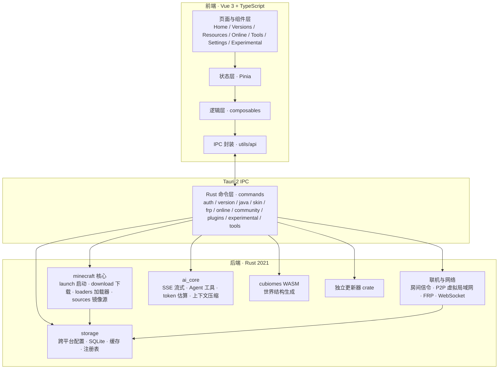

<p align="center">
  
</p>

# MoLaunch

[简体中文](./README.md) · [繁體中文](./README_ZH-HANT.md) · [English](./README_EN.md) · [日本語](./README_JA.md)

现代化、跨平台的 Minecraft Java 版启动器。

[](./LICENSE)
[](https://github.com/MoTeam-cn/MoLaunch)
[](https://v2.tauri.app/)
[](https://vuejs.org/)
[](https://www.rust-lang.org/)
[](https://github.com/MoTeam-cn/MoLaunch)

[](https://github.com/MoTeam-cn/MoLaunch/stargazers)
[](https://github.com/MoTeam-cn/MoLaunch/forks)
[](https://github.com/MoTeam-cn/MoLaunch/issues)
[](https://github.com/MoTeam-cn/MoLaunch/commits)
[](https://github.com/MoTeam-cn/MoLaunch/graphs/contributors)

> [!CAUTION]
> MoLaunch 是独立的第三方 Minecraft 启动器项目，不是 Mojang 或 Microsoft 的官方产品，也未获其批准或与其建立关联。

> [!IMPORTANT]
> 本项目为个人独立开发，为了图省事，不少地方是用 AI 辅助（Vibe Coding）写的，效果可能不尽如人意，还请大家多包涵。

## 简介

MoLaunch 是一款 Minecraft Java 版启动器，提供下载、安装、启动、联机等完整的游戏管理能力，基于 **Tauri 2 + Vue 3 + Rust** 构建，并内置一整套实用的游戏工具。

本仓库为 MoLaunch 的开源代码。你可以直接使用构建产物，也可以基于本仓库自行编译、二次开发。

## 界面预览

<table align="center">
  <tr>
    <td align="center" width="50%">
      <b>启动器主页</b><br/>
      <sub>默认简约内容区，布局可在设置中调整（images/001.png）</sub><br/><br/>
      
    </td>
    <td align="center" width="50%">
      <b>版本下载页</b><br/>
      <sub>正式版 / 快照版 / 愚人节版 / 远古版四类（images/002.png）</sub><br/><br/>
      
    </td>
  </tr>
  <tr>
    <td align="center">
      <b>社区整合包</b><br/>
      <sub>Modrinth 与 CurseForge 整合包列表与安装（images/003.png）</sub><br/><br/>
      
    </td>
    <td align="center">
      <b>联机大厅</b><br/>
      <sub>创建 / 加入房间联机（当前暂无测试房间）（images/004.png）</sub><br/><br/>
      
    </td>
  </tr>
  <tr>
    <td align="center">
      <b>种子地图</b><br/>
      <sub>输入种子定位世界结构（准确率仍在优化中）（images/005.png）</sub><br/><br/>
      
    </td>
    <td align="center">
      <b>AI 聊天（实验性）</b><br/>
      <sub>对话式智能助手，帮你分析日志与崩溃原因（images/006.png）</sub><br/><br/>
      
    </td>
  </tr>
  <tr>
    <td align="center">
      <b>皮肤与披风管理</b><br/>
      <sub>皮肤与披风更换（images/007.png）</sub><br/><br/>
      
    </td>
    <td align="center">
      <b>设置页面</b><br/>
      <sub>外观、启动 / 下载偏好、开发者选项（images/008.png）</sub><br/><br/>
      
    </td>
  </tr>
</table>

## 功能特性

### 版本管理

- 支持原版、Forge、Fabric、NeoForge、OptiFine、LiteLoader 加载器
- CurseForge / Modrinth 整合包安装，自动补齐加载器与依赖
- 多版本隔离，各实例独立存放
- Java 自动检测：按版本校验运行时需求，缺失时预下载（Mojang 官方 Runtime）

### 下载

- Mod / 资源包 / 整合包搜索与安装，数据源支持 CurseForge、Modrinth 与 BMCLAPI 镜像
- 分片并发下载、断点续传、暂停与校验
- 国内镜像加速（BMCLAPI / MoCDN）

### 账户

- 微软 OAuth 设备码登录、离线账户
- 凭据本地加密存储，自动刷新

### 皮肤

- 皮肤 / 披风管理
- 3D 实时预览（skinview3d）

### 联机

- 联机大厅、房间管理，邀请码 / 黑名单
- WebRTC P2P 虚拟局域网（虚拟 TUN 网卡）
- FRP 隧道，多厂商接入，免端口映射

### 工具

- 种子地图：输入种子定位要塞、海底神殿等世界结构（cubiomes WASM）
- NBT 编辑、存档备份 / 还原、Mod 依赖检查、服务器延迟测试、Java 运行时检测等

### AI 助手（实验性）

- 对话式助手，可读取游戏日志、崩溃报告、Mod 列表
- 日志与崩溃分析：本地规则引擎初检 + AI 深度分析
- 支持 OpenAI 兼容端点（含 DeepSeek R1 等思考模型）

### 插件

- 插件 SDK 与沙箱：自定义布局、系统监控、启动历史等，权限可配置

### 其他

- 开屏启动动画（双窗口 splashscreen）
- 崩溃分析（规则引擎 + AI 建议）
- 自动更新（stable / beta / alpha 通道）
- 日志脱敏、全局 CSP、用户协议门禁

### 与 MoLaunch 云端

启动器的注册、登录、刷新凭证等操作都会和 MoLaunch 云端（api-server）对接，云端在这些接口前加了一道轻量的 PoW 验证，先让你随手算一道哈希题才放行，防止有人拿脚本疯狂刷接口。正常使用几乎无感，登录等操作也就几十毫秒；真正会被这道题拦下的，只有批量刷接口的那批人。

## 技术架构

MoLaunch 采用 Tauri 2 双进程架构：前端为 Vue 3 单页应用，后端为 Rust 原生进程，两者通过类型化 IPC 通信；重活（下载、解压、启动、组网）全部下沉到 Rust，前端保持轻量。



### 前端

Vue 3 + TypeScript + Vite + Pinia + Vue Router + Tailwind CSS。自研统一组件库（Button / Input / Select / Drawer / Modal / Tooltip / Slider 等），单列布局风格；复杂业务逻辑全部收敛到 composables 与 stores，组件保持轻量。

其中 **Button / Input / Select / Drawer / Slider** 等核心组件参考借鉴了 [Arco Design Vue](https://github.com/arco-design/arco-design-vue)：提取其组件源码并复刻改写为 Vue SFC + Tailwind 形式，以获得一致的视觉体验与交互质量，涉及复刻的文件顶部均已添加 Arco Design MIT 许可证要求的版权声明注释。图标以 [Heroicons](https://github.com/tailwindlabs/heroicons) 为主，并按需复用 [Element Plus Icons](https://github.com/element-plus/element-plus-icons) 的 SVG path 数据（集中写入 `src/utils/element-icons.ts`，未引入运行时依赖）。详见设置页「关于 · 鸣谢」版权声明及下方「鸣谢」。

### 后端

Rust 2021 + Tokio 异步运行时。核心能力按域拆分：

- **minecraft**：版本清单解析、多源下载、加载器安装、JVM 参数组装、进程监控
- **online**：房间信令、WebRTC 组网（虚拟 TUN）、FRP 隧道管理
- **ai_core**：OpenAI 兼容客户端，SSE 流式、多轮工具调用、上下文自动压缩
- **storage**：Windows 注册表 + 跨平台文件双后端配置存储、SQLite 内置编译
- **cubiomes**：Minecraft 世界生成 C 库，编译为 WASM 供结构寻址工具调用
- **updater**：独立更新器 crate，支持分通道发布与签名校验（实为复刻 Tauri plugin的updater，因Windows需要安装，而便携版性质原因，就自己实现了一套无感更新套件）

### 项目结构

```text
MoLaunch/
├── src/                    # 前端（Vue 3 + TypeScript）
│   ├── components/         #   公共组件库与业务组件
│   ├── composables/        #   组合式逻辑
│   ├── stores/             #   Pinia 状态
│   ├── utils/api/          #   Tauri IPC 封装
│   ├── views/              #   页面（home / versions / online / tools / settings / experimental）
│   └── plugins/            #   插件 SDK 与沙箱
├── src-tauri/              # 后端（Rust + Tauri 2）
│   ├── src/commands/       #   IPC 命令模块
│   ├── src/minecraft/      #   启动 / 下载 / 加载器 / 镜像源
│   ├── src/state/          #   应用状态（config / launch / download）
│   ├── src/storage/        #   跨平台存储与 SQLite
│   ├── cubiomes/           #   世界结构生成 C 库（WASM）
│   ├── resources/          #   内嵌资源与第三方许可清单
│   └── updater/            #   独立更新器
├── public/                 # 静态资源（开屏动画页）
├── docs/                   # 设计与审计文档
├── CHANGELOG.md
└── LICENSE
```

## 环境要求

- Node.js 18+ 与 npm
- Rust stable（2021 edition）
- Tauri 2 系统依赖（详见 [Tauri 官方文档](https://v2.tauri.app/start/prerequisites/)）

## 开发与构建

```bash
npm ci
npm run tauri dev      # 开发调试
npm run tauri build    # 打包桌面应用
```

质量检查：

```bash
npm run lint && npm run typecheck && npm run test
cd src-tauri && cargo fmt --all -- --check && cargo clippy --all-targets --all-features -- -D warnings && cargo test --all-features
```

## 许可证

MoLaunch 自有代码与原创资源遵循 [MoLaunch 分发有限许可证](./LICENSE)，核心要求：

- 禁止将 MoLaunch 或其二次开发版本作为商业产品使用或收费
- 二次开发必须公开完整源代码，并明确声明为第三方版本（不得使用易误认为官方的名称）
- 不得移除版权、许可证、商标与免责声明

第三方依赖、内嵌资源与引用项目须遵守其各自原始许可证，详见 [licenses.txt](./src-tauri/resources/about/licenses.txt)。如需商业授权等例外许可，请联系 MoTeam 并取得书面授权。

Minecraft 是 Mojang Synergies AB 的商标。MoLaunch 不隶属于 Mojang、Microsoft 或其他相关权利人，本项目按"现状"提供。

## 鸣谢

感谢以下开源项目与社区的杰出贡献，MoLaunch 站在巨人的肩膀上。

### 特别感谢

- **[Arco Design Vue](https://github.com/arco-design/arco-design-vue)** — 前端核心组件（Button / Input / Select / Drawer / Slider 等）参考借鉴其实现，提取源码复刻改写为 Vue SFC + Tailwind 形式，版权声明注释见各源文件顶部
- **[Element Plus Icons](https://github.com/element-plus/element-plus-icons)** — 按需提取 SVG path 数据复用（`src/utils/element-icons.ts`），仅引入图标未引入运行时依赖
- **[Plain Craft Launcher 2 (PCL2)](https://github.com/Meloong-Git/PCL)** — 一款被广泛使用的 Minecraft 启动器；MoLaunch 前期从零开始开发，启动 Minecraft 的相关逻辑参考了 PCL2 的实现

### 核心依赖

- **[Vue 3](https://github.com/vuejs/core)** / [Vue Router](https://github.com/vuejs/router) / [Pinia](https://github.com/vuejs/pinia) — 前端框架与状态管理
- **[Tauri 2](https://github.com/tauri-apps/tauri)** — 桌面应用框架（Rust + WebView）
- **[Tailwind CSS](https://github.com/tailwindlabs/tailwindcss)** — 原子化样式方案
- **[Heroicons](https://github.com/tailwindlabs/heroicons)** — 主图标库
- **[skinview3d](https://github.com/bs-community/skinview3d)** — 皮肤 3D 实时预览
- **[Cubiomes](https://github.com/Cubitect/cubiomes)** — 世界结构生成算法（编译为 WASM）
- **[OpenLayers](https://github.com/openlayers/openlayers)** — 结构寻址交互式地图
- **[Tokio](https://github.com/tokio-rs/tokio)** / **[Reqwest](https://github.com/seanmonstar/reqwest)** — Rust 异步运行时与 HTTP 客户端

完整第三方许可与版权清单见 [licenses.txt](./src-tauri/resources/about/licenses.txt)。

> [!NOTE]
> MoLaunch 为独立第三方创作，与 PCL2 无隶属或关联关系；PCL2 采用《PCL 分发有限许可》，详情参阅其[许可文档](https://shimo.im/docs/rGrd8pY8xWkt6ryW)。

## 相关链接

- 仓库：https://github.com/MoTeam-cn/MoLaunch
- 问题反馈：https://github.com/MoTeam-cn/MoLaunch/issues
- 更新日志：[CHANGELOG.md](./CHANGELOG.md)
- 许可证：[LICENSE](./LICENSE)
- 第三方版权清单：[licenses.txt](./src-tauri/resources/about/licenses.txt)
