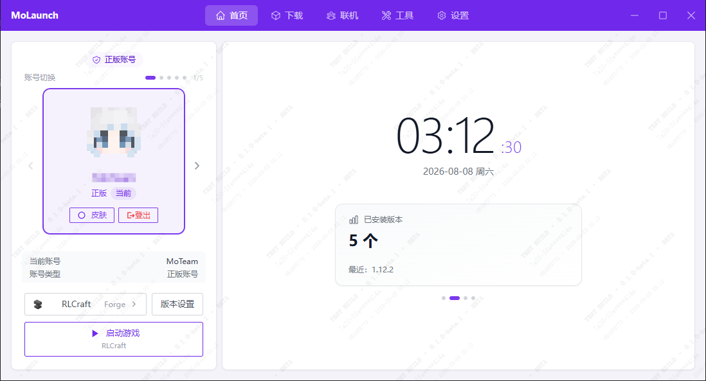
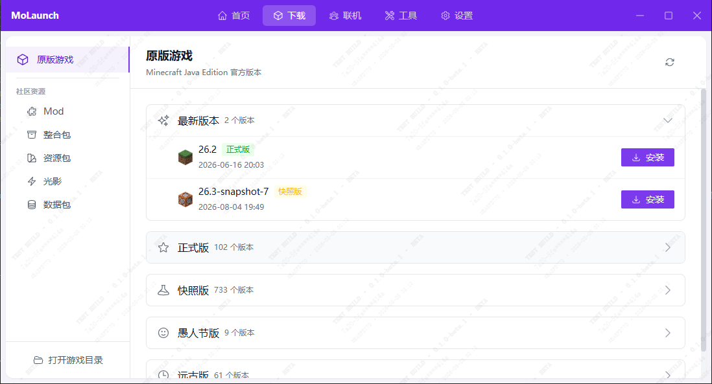
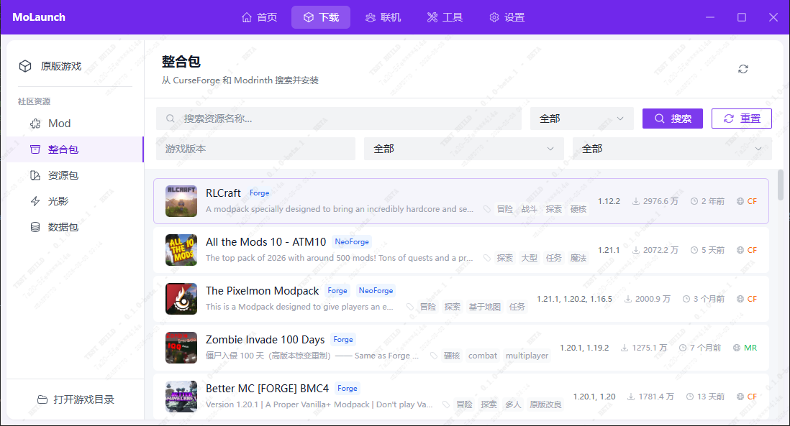
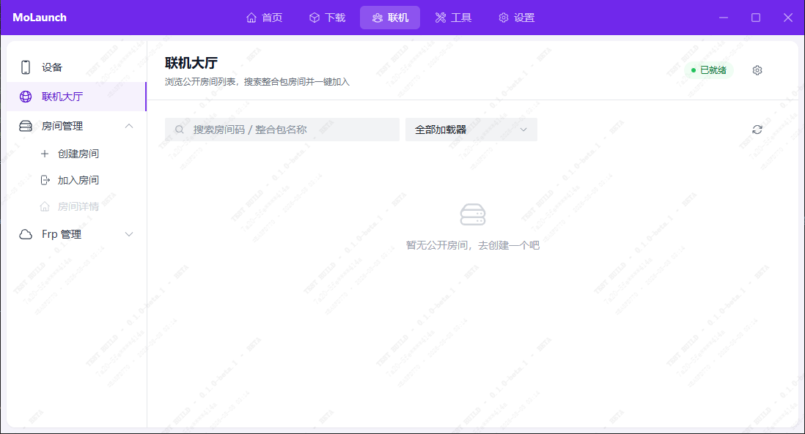
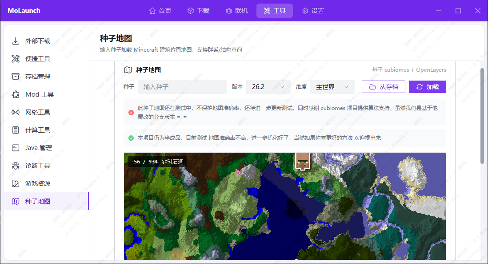
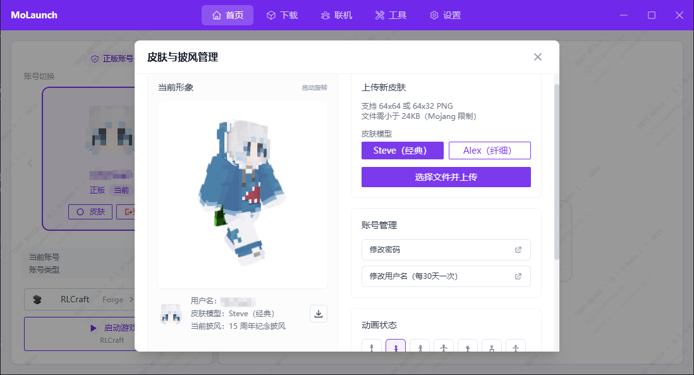
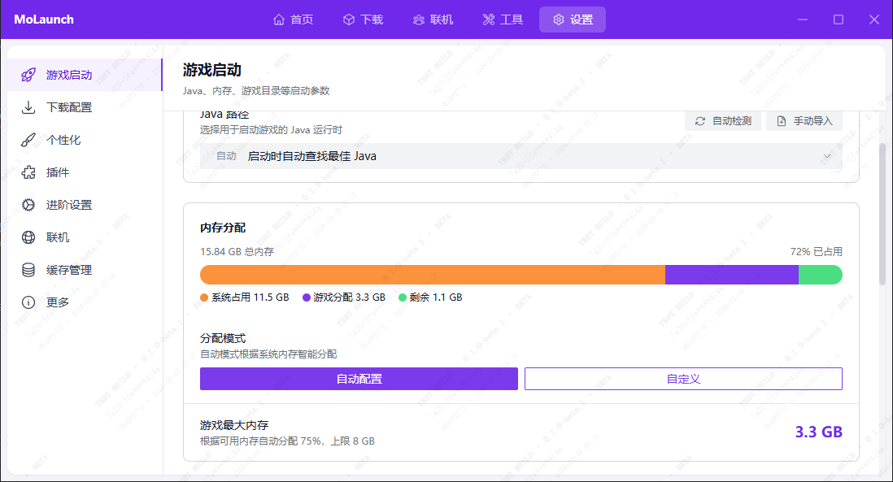

  

# MoLaunch

[简体中文](./README.md) · [繁體中文](./README_ZH-HANT.md) · [English](./README_EN.md) · [日本語](./README_JA.md)

モダンでクロスプラットフォームな Minecraft Java Edition ランチャー。

> [!CAUTION]
> MoLaunch は独立したサードパーティ製 Minecraft ランチャープロジェクトであり、Mojang や Microsoft の公式製品ではありません。また、両社による承認や提携も受けていません。

> [!IMPORTANT]
> 本プロジェクトは個人が独自に開発しており、手間を省くため多くの部分を AI 支援（Vibe Coding）で記述しています。完成度に不満な点があるかもしれませんが、ご容赦ください。

## 概要

MoLaunch は、ダウンロード・インストール・起動・オンラインマルチプレイなど、ゲーム管理に必要な機能を一式備えた Minecraft Java Edition ランチャーです。**Tauri 2 + Vue 3 + Rust** で構築し、実用的なゲームツールも内蔵しています。

本リポジトリは MoLaunch のオープンソースコードです。ビルド済みの成果物をそのまま利用できますし、本リポジトリを元に自前でコンパイル・二次開発することもできます。

## 画面プレビュー

<table align="center">
  <tr>
    <td align="center" width="50%">
      <b>ランチャーホーム</b> 
      デフォルトはシンプルなコンテンツ領域。レイアウトは設定で変更可能（images/001.png）  
      
    </td>
    <td align="center" width="50%">
      <b>バージョン一覧</b> 
      正式版 / スナップショット版 / エイプリルフール版 / レガシー版の 4 種（images/002.png）  
      
    </td>
  </tr>
  <tr>
    <td align="center">
      <b>コミュニティ Modパック</b> 
      Modrinth / CurseForge の Modパック一覧とインストール（images/003.png）  
      
    </td>
    <td align="center">
      <b>オンラインロビー</b> 
      ルームを作成・参加してオンラインマルチプレイ（現在テスト用ルームはありません）（images/004.png）  
      
    </td>
  </tr>
  <tr>
    <td align="center">
      <b>シードマップ</b> 
      シード値を入力してワールド構造を探知（精度は改善中）（images/005.png）  
      
    </td>
    <td align="center">
      <b>AI チャット（実験的）</b> 
      ログやクラッシュ原因の解析を助ける対話型アシスタント（images/006.png）  
      
    </td>
  </tr>
  <tr>
    <td align="center">
      <b>スキン・ケープ管理</b> 
      スキンとケープの変更（images/007.png）  
      
    </td>
    <td align="center">
      <b>設定画面</b> 
      外観、起動・ダウンロードの設定、開発者向けオプション（images/008.png）  
      
    </td>
  </tr>
</table>

## 機能一覧

MoLaunch は Minecraft の起動から遊ぶまでをワンストップでカバーし、すぐに使えます：

- **バージョン管理** — バニラ / Forge / Fabric / NeoForge / OptiFine などのローダーに対応、バージョンごとに分離
- **ダウンロードとインストール** — Mod、リソースパック、Modパックをワンクリックインストール（CurseForge / Modrinth）、レジューム対応 + 中国国内ミラー高速化
- **アカウントとスキン** — Microsoft アカウントログイン、スキン / ケープ管理と 3D プレビュー
- **オンラインマルチプレイ** — ルームロビー、WebRTC P2P 仮想 LAN、ポートオープン不要の FRP トンネル
- **ユーティリティ** — シードマップ、NBT エディタ、ワールドバックアップ、Mod 依存関係チェックなど
- **AI アシスタント（実験的）** — ゲームログとクラッシュ原因を対話形式で分析

ログインなどのクラウド操作は MoLaunch クラウドと連携し、API の前に軽量な PoW 認証を挟んでスクリプトによる大量アクセスを防止。通常利用ではほぼ無感覚です。

## ライセンス

MoLaunch 独自のコードとオリジナルリソースは [MoLaunch 配布ライセンス（有限許諾）](./LICENSE) に従います。主な要件：

- MoLaunch またはそれを二次開発したバージョンを商用製品として利用・販売してはならない
- 二次開発者は完全なソースコードを公開し、サードパーティ版であることを明確に示さなければならない（公式と誤認されやすい名称は使えない）
- 著作権、ライセンス、商標、免責事項を除去してはならない

サードパーティの依存ライブラリ、同梱リソース、参照プロジェクトはそれぞれのライセンスに従います。詳細は [licenses.txt](./src-tauri/resources/about/licenses.txt) を参照してください。商用ライセンスなどの例外が必要な場合は、MoTeam に連絡して書面による承認を得てください。

Minecraft は Mojang Synergies AB の商標です。MoLaunch は Mojang、Microsoft、その他の権利者とは一切関係ありません。本プロジェクトは「現状のまま（AS IS）」で提供されます。

## 謝辞

以下に挙げるオープンソースプロジェクトとコミュニティの多大な貢献に感謝します。MoLaunch は巨人の肩の上に立っています。

### 特筆すべき感謝

- **[Arco Design Vue](https://github.com/arco-design/arco-design-vue)** — フロントエンドのコアコンポーネント（Button / Input / Select / Drawer / Slider など）の実装を参考に、ソースコードを抽出して Vue SFC + Tailwind 形式に書き直しています。著作権表示は各ソースファイルの先頭に記載
- **[Element Plus Icons](https://github.com/element-plus/element-plus-icons)** — SVG パスデータを抽出して使用（`src/utils/element-icons.ts`）。アイコンのみで実行時依存はなし
- **[Plain Craft Launcher 2 (PCL2)](https://github.com/Meloong-Git/PCL)** — 広く使われている Minecraft ランチャー。MoLaunch は当初ゼロから開発を始めましたが、一部の起動ロジックで参考にさせていただきました

### コア依存

- **[Vue 3](https://github.com/vuejs/core)** / [Vue Router](https://github.com/vuejs/router) / [Pinia](https://github.com/vuejs/pinia) — フロントエンドのフレームワークと状態管理
- **[Tauri 2](https://github.com/tauri-apps/tauri)** — デスクトップアプリケーションフレームワーク（Rust + WebView）
- **[Tailwind CSS](https://github.com/tailwindlabs/tailwindcss)** — ユーティリティファーストな CSS ソリューション
- **[Heroicons](https://github.com/tailwindlabs/heroicons)** — メインのアイコンライブラリ
- **[skinview3d](https://github.com/bs-community/skinview3d)** — スキンの 3D リアルタイムプレビュー
- **[Cubiomes](https://github.com/Cubitect/cubiomes)** — ワールド構造生成アルゴリズム（WASM にコンパイル）
- **[OpenLayers](https://github.com/openlayers/openlayers)** — 構造検索用のインタラクティブマップ
- **[Tokio](https://github.com/tokio-rs/tokio)** / **[Reqwest](https://github.com/seanmonstar/reqwest)** — Rust 非同期ランタイムと HTTP クライアント

サードパーティのライセンスと著作権の完全な一覧は [licenses.txt](./src-tauri/resources/about/licenses.txt) を参照してください。

> [!NOTE]
> MoLaunch は、PCL2 とは一切関係のない独立したサードパーティ製のソフトウェアです。PCL2 は「PCL 配布ライセンス」の条件で配布されており、詳細はその[ライセンス文書](https://shimo.im/docs/rGrd8pY8xWkt6ryW)をご覧ください。

## 貢献者

MoLaunch にコード・ドキュメント・提案を提供してくださったすべての開発者に感謝します。

## 関連リンク

- リポジトリ：https://github.com/MoTeam-cn/MoLaunch
- 問題のフィードバック：https://github.com/MoTeam-cn/MoLaunch/issues
- 更新ログ：[CHANGELOG.md](./CHANGELOG.md)
- ライセンス：[LICENSE](./LICENSE)
- サードパーティの著作権一覧：[licenses.txt](./src-tauri/resources/about/licenses.txt)