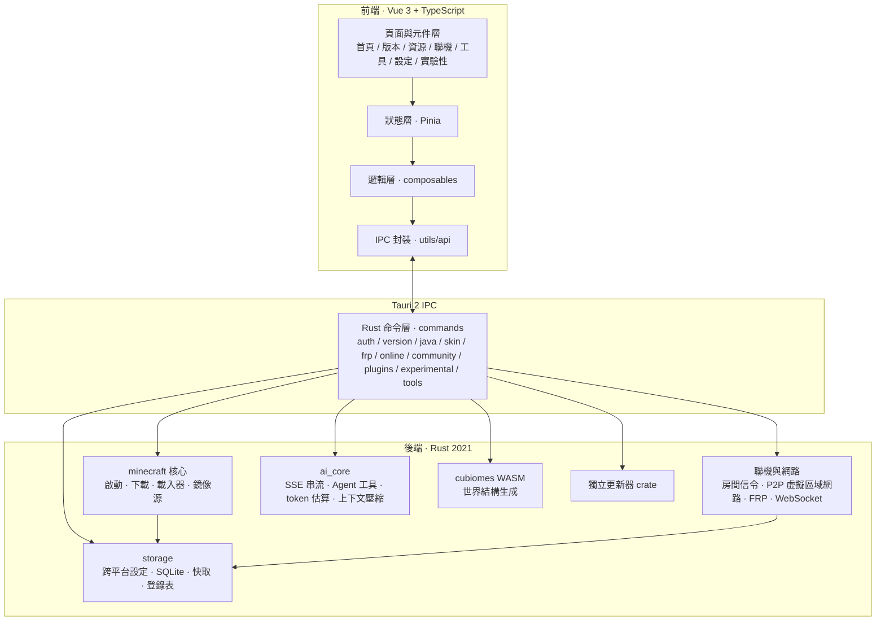

<p align="center">
  
</p>

# MoLaunch

[簡體中文](./README.md) · [繁體中文](./README_ZH-HANT.md) · [English](./README_EN.md) · [日本語](./README_JA.md)

現代化、跨平台的 Minecraft Java 版啟動器。

[](./LICENSE)
[](https://github.com/MoTeam-cn/MoLaunch)
[](https://v2.tauri.app/)
[](https://vuejs.org/)
[](https://www.rust-lang.org/)
[](https://github.com/MoTeam-cn/MoLaunch)

[](https://github.com/MoTeam-cn/MoLaunch/stargazers)
[](https://github.com/MoTeam-cn/MoLaunch/forks)
[](https://github.com/MoTeam-cn/MoLaunch/issues)
[](https://github.com/MoTeam-cn/MoLaunch/commits)
[](https://github.com/MoTeam-cn/MoLaunch/graphs/contributors)

> [!CAUTION]
> MoLaunch 是獨立的第三方 Minecraft 啟動器專案，不是 Mojang 或 Microsoft 的官方產品，也未獲得其核准或與其建立關聯。

> [!IMPORTANT]
> 本專案為個人獨立開發，為了圖省事，不少地方是用 AI 輔助（Vibe Coding）寫的，效果可能不盡如人意，還請大家多多包涵。

## 簡介

MoLaunch 是一款 Minecraft Java 版啟動器，提供下載、安裝、啟動、聯機等完整的遊戲管理能力，基於 **Tauri 2 + Vue 3 + Rust** 構建，並內建一整套實用的遊戲工具。

本倉庫為 MoLaunch 的開源程式碼。你可以直接使用建置產物，也可以基於本倉庫自行編譯、二次開發。

## 介面預覽

<table align="center">
  <tr>
    <td align="center" width="50%">
      <b>啟動器首頁</b><br/>
      <sub>預設簡約內容區，版面可在設定中調整（images/001.png）</sub><br/><br/>
      
    </td>
    <td align="center" width="50%">
      <b>版本下載頁</b><br/>
      <sub>正式版 / 快照版 / 愚人節版 / 遠古版四類（images/002.png）</sub><br/><br/>
      
    </td>
  </tr>
  <tr>
    <td align="center">
      <b>社群整合包</b><br/>
      <sub>Modrinth 與 CurseForge 整合包列表與安裝（images/003.png）</sub><br/><br/>
      
    </td>
    <td align="center">
      <b>聯機大廳</b><br/>
      <sub>建立 / 加入房間聯機（目前暫無測試房間）（images/004.png）</sub><br/><br/>
      
    </td>
  </tr>
  <tr>
    <td align="center">
      <b>種子地圖</b><br/>
      <sub>輸入種子定位世界結構（準確率仍在最佳化中）（images/005.png）</sub><br/><br/>
      
    </td>
    <td align="center">
      <b>AI 聊天（實驗性）</b><br/>
      <sub>對話式智慧助手，幫你分析日誌與崩潰原因（images/006.png）</sub><br/><br/>
      
    </td>
  </tr>
  <tr>
    <td align="center">
      <b>皮膚與披風管理</b><br/>
      <sub>皮膚與披風更換（images/007.png）</sub><br/><br/>
      
    </td>
    <td align="center">
      <b>設定頁面</b><br/>
      <sub>外觀、啟動 / 下載偏好、開發者選項（images/008.png）</sub><br/><br/>
      
    </td>
  </tr>
</table>

## 功能特色

### 版本管理

- 支援原版、Forge、Fabric、NeoForge、OptiFine、LiteLoader 載入器
- CurseForge / Modrinth 整合包安裝，自動補齊載入器與依賴
- 多版本隔離，各實例獨立存放
- Java 自動偵測：依版本驗證執行時期需求，缺失預先下載（Mojang 官方 Runtime）

### 下載

- Mod / 資源包 / 整合包搜尋與安裝，資料來源支援 CurseForge、Modrinth 與 BMCLAPI 鏡像
- 分片並行下載、續傳、暫停與驗證
- 中國境內鏡像加速（BMCLAPI / MoCDN）

### 帳戶

- Microsoft OAuth 裝置碼登入、離線帳戶
- 憑證本地加密儲存，自動重新整理

### 皮膚

- 皮膚 / 披風管理
- 3D 即時預覽（skinview3d）

### 聯機

- 聯機大廳、房間管理，邀請碼 / 黑名單
- WebRTC P2P 虛擬區域網路（虛擬 TUN 網路卡）
- FRP 隧道，多廠商接入，免連接埠對應

### 工具

- 種子地圖：輸入種子定位要塞、海底神殿等世界結構（cubiomes WASM）
- NBT 編輯、存檔備份 / 還原、Mod 依賴檢查、伺服器延遲測試、Java 執行環境偵測等

### AI 助手（實驗性）

- 對話式助手，可讀取遊戲日誌、崩潰報告、Mod 清單
- 日誌與崩潰分析：本地規則引擎初檢 + AI 深度分析
- 支援 OpenAI 相容端點（含 DeepSeek R1 等推理模型）

### 外掛

- 外掛 SDK 與沙箱：自訂版面、系統監控、啟動歷史等，權限可設定

### 其他

- 開屏啟動動畫（雙視窗 splashscreen）
- 崩潰分析（規則引擎 + AI 建議）
- 自動更新（stable / beta / alpha 通道）
- 日誌去敏、全域 CSP、使用者協定門檻

### 與 MoLaunch 雲端

啟動器的註冊、登入、重新整理憑證等操作都會與 MoLaunch 雲端（api-server）對接，雲端在這些介面前加了一道輕量 PoW 驗證，先讓你隨手算一道雜湊題才放行，防止有人用腳本狂刷介面。正常使用幾乎無感，登入等操作也就幾十毫秒；真正會被這道題攔下的，只有批次刷介面的那些人。

## 技術架構

MoLaunch 採用 Tauri 2 雙進程架構：前端為 Vue 3 單頁應用程式，後端為 Rust 原生程序，兩者透過型別化 IPC 通訊；重活（下載、解壓、啟動、組網）全部下沉到 Rust，前端保持輕量。



### 前端

Vue 3 + TypeScript + Vite + Pinia + Vue Router + Tailwind CSS。自研統一元件庫（Button / Input / Select / Drawer / Modal / Tooltip / Slider 等），單欄版式風格；複雜業務邏輯全部收斂到 composables 與 stores，元件保持輕量。

其中 **Button / Input / Select / Drawer / Slider** 等核心元件參考了 [Arco Design Vue](https://github.com/arco-design/arco-design-vue)：提取其元件原始碼並複刻改寫為 Vue SFC + Tailwind 形式，以獲得一致的視覺體驗與互動品質，涉及複刻的檔案頂部均已新增 Arco Design MIT 許可證要求的版權聲明註解。圖示以 [Heroicons](https://github.com/tailwindlabs/heroicons) 為主，並按需復用 [Element Plus Icons](https://github.com/element-plus/element-plus-icons) 的 SVG 資料（集中寫入 `src/utils/element-icons.ts`，未引入執行期依賴）。詳見設定頁「關於 · 鳴謝」版權聲明及下方「鳴謝」。

### 後端

Rust 2021 + Tokio 非同步執行環境。核心能力依領域拆分：

- **minecraft**：版本清單解析、多源下載、載入器安裝、JVM 參數組裝、程序監控
- **online**：房間信令、WebRTC 組網（虛擬 TUN）、FRP 隧道管理
- **ai_core**：OpenAI 相容用戶端，SSE 串流、多輪工具呼叫、上下文自動壓縮
- **storage**：Windows 登錄表 + 跨平台檔案雙後端設定存放、SQLite 內建編譯
- **cubiomes**：Minecraft 世界生成 C 函式庫，編譯為 WASM 供結構定址工具呼叫
- **updater**：獨立更新器 crate，支援分通道發布與簽章驗證（實為複刻 Tauri plugin 的 updater，因 Windows 需要安裝、而本軟體為免安裝（便攜版）性質，故自行實作了一套無感更新套件）

### 專案結構

```text
MoLaunch/
├── src/                    # 前端（Vue 3 + TypeScript）
│   ├── components/         #   公共元件庫與業務元件
│   ├── composables/        #   組合式邏輯
│   ├── stores/             #   Pinia 狀態
│   ├── utils/api/          #   Tauri IPC 封裝
│   ├── views/              #   頁面（home / versions / online / tools / settings / experimental）
│   └── plugins/            #   外掛 SDK 與沙箱
├── src-tauri/              # 後端（Rust + Tauri 2）
│   ├── src/commands/       #   IPC 指令模組
│   ├── src/minecraft/      #   啟動 / 下載 / 載入器 / 鏡像源
│   ├── src/state/          #   應用程式狀態（config / launch / download）
│   ├── src/storage/        #   跨平台儲存與 SQLite
│   ├── cubiomes/           #   世界結構生成 C 函式庫（WASM）
│   ├── resources/          #   內嵌資源與第三持方授權清單
│   └── updater/            #   獨立更新器
├── public/                 # 靜態資源（開場動畫頁）
├── docs/                   # 設計與審計文件
├── CHANGELOG.md
└── LICENSE
```

## 環境要求

- Node.js 18+ 與 npm
- Rust stable（2021 edition）
- Tauri 2 系統依賴（詳見 [Tauri 官方文件](https://v2.tauri.app/start/prerequisites/)）

## 開發與建置

```bash
npm ci
npm run tauri dev      # 開發偵錯
npm run tauri build    # 打包桌面應用程式
```

品質檢查：

```bash
npm run lint && npm run typecheck && npm run test
cd src-tauri && cargo fmt --all -- --check && cargo clippy --all-targets --all-features -- -D warnings && cargo test --all-features
```

## 授權許可

MoLaunch 自有程式碼與原創資源遵循 [MoLaunch 分發有限許可](./LICENSE)，核心要求：

- 禁止將 MoLaunch 或其二次開發版本作為商業產品使用或收費，
- 二次開發必須公開完整原始碼，並明確聲明為第三方版本（不得使用易誤認為官方的名稱）
- 不得移除版權、授權、商標與免責聲明

第三方依賴、內嵌資源與引用專案須遵守，其各原始授權，詳見 [licenses.txt](./src-tauri/resources/about/licenses.txt)。如需商業授權等例外，請聯繫 MoTeam 並取得書面授權。

Minecraft 為 Mojang Synergies AB 的商標。MoLaunch 不隸屬於 Mojang、Microsoft 或 其他相關權利人，本專案按「現狀」提供。

## 鳴謝

感謝以下開源專案與社群的傑出貢獻，MoLaunch 站在巨人的肩膀上。

### 特別感謝

- **[Arco Design Vue](https://github.com/arco-design/arco-design-vue)** — 前端核心元件（Button / Input / Select / Drawer / Slider 等）參考其特色與實作，提取原始碼複刻改寫為 Vue SFC + Tailwind 形式，版權聲明註解見各原始檔頂部
- **[Element Plus Icons](https://github.com/element-plus/element-plus-icons)** — 依需求提取 SVG path 資料（`src/utils/element-icons.ts`），僅引入圖示未引入執行期依賴
- **[Plain Craft Launcher 2 (PCL2)](https://github.com/Meloong-Git/PCL)** — 一款被廣泛使用的 Minecraft 啟動器；MoLaunch 前期從零開始開發，為相關啟動邏輯提供了實作參考

### 核心依賴

- **[Vue 3](https://github.com/vuejs/core)** / [Vue Router](https://github.com/vuejs/router) / [Pinia](https://github.com/vuejs/pinia) — 前端框架與狀態管理
- **[Tauri 2](https://github.com/tauri-apps/tauri)** — 桌面應用框架（Rust + WebView）
- **[Tailwind CSS](https://github.com/tailwindlabs/tailwindcss)** — 原子化 CSS 方案
- **[Heroicons](https://github.com/tailwindlabs/heroicons)** — 主圖示庫
- **[skinview3d](https://github.com/bs-community/skinview3d)** — 皮膚 3D 即時預覽
- **[Cubiomes](https://github.com/Cubitect/cubiomes)** — 世界結構產生演算法（編譯為 WASM）
- **[OpenLayers](https://github.com/openlayers/openlayers)** — 結構定址互動式地圖
- **[Tokio](https://github.com/tokio-rs/tokio)** / **[Reqwest](https://github.com/seanmonstar/reqwest)** — Rust 非同步執行環境與 HTTP 用戶端

完整第三方授權與版權清單見 [licenses.txt](./src-tauri/resources/about/licenses.txt)。

> [!NOTE]
> MoLaunch 為獨立第三方創作，與 PCL2 無隸屬或關聯；PCL2 採用《PCL 分發有限許可》，詳情參閱其[授權文件](https://shimo.im/docs/rGrd8pY8xWkt6ryW)。

## 相關連結

- 儲存庫：https://github.com/MoTeam-cn/MoLaunch
- 問題回饋：https://github.com/MoTeam-cn/MoLaunch/issues
- 更新日誌：[CHANGELOG.md](./CHANGELOG.md)
- 授權：[LICENSE](./LICENSE)
- 第三方著作權清單：[licenses.txt](./src-tauri/resources/about/licenses.txt)