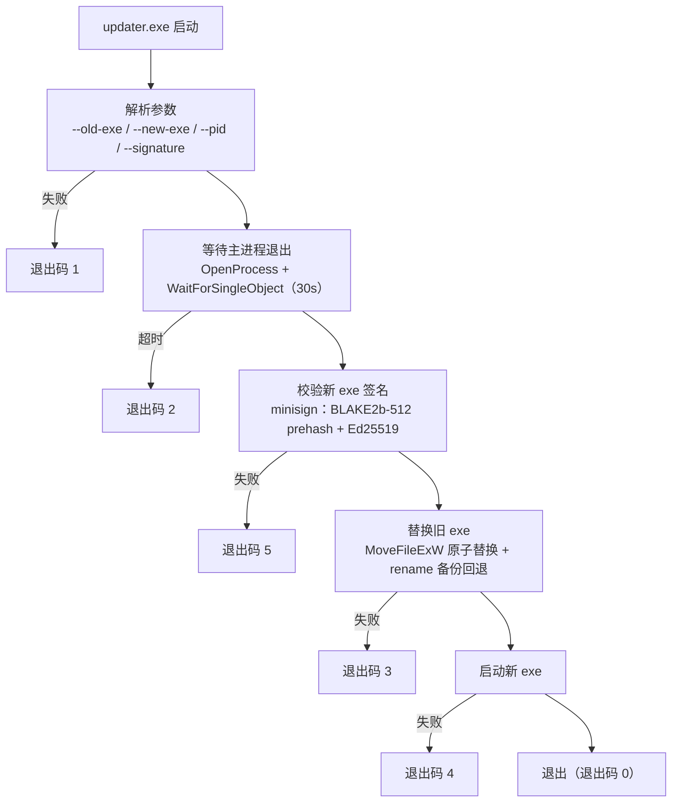

# MoLaunch Updater

Windows 便携版更新器（独立子进程），负责替换运行中的主程序 exe。

[](https://www.rust-lang.org/)
[](https://github.com/MoTeam-cn/MoLaunch)
[](https://github.com/jedisct1/minisign)
[](./LICENSE)

> [!IMPORTANT]
> 这是 MoLaunch 主仓库内的独立子 crate（`src-tauri/updater`），不是完整启动器。完整产品说明见仓库根目录 [README.md](../../README.md)。

## 简介

MoLaunch 采用双进程更新方案：主程序下载新版本 exe 后，由本更新器作为独立子进程接管「等待退出 → 验签 → 替换 → 重启」的全过程，实现 Windows 便携版的无感更新（便携版主程序通常被占用，无法在自身进程内替换，因此拆出独立进程执行）。

本更新器基于 **Rust + Windows API** 构建，仅做本地文件操作，不发起任何网络请求。

## 工作流程



## 功能特性

### 等待主进程退出

通过 `--pid` 打开主进程句柄（`OpenProcess` + `PROCESS_SYNCHRONIZE`），用 `WaitForSingleObject` 等待其退出释放文件锁，默认超时 30 秒；进程句柄打不开时视为已退出。

### 签名校验

校验新 exe 的 **minisign** 签名（与 `tauri-plugin-updater` 同款 `minisign-verify` crate）：

- 公钥：与 `src-tauri/tauri.conf.json` 的 `plugins.updater.pubkey` 保持同一份（`dW` 开头完整 base64，解码后为两行 `minisign.pub` 文本），硬编码于 [verify.rs](src/verify.rs)
- 签名：标准 minisign `.sig` 文件内容（4 行：untrusted comment / 签名行 / trusted comment / 全局签名行），由 CI 的 `tauri signer` / `tauri-action` 生成
- 校验：key_id 匹配 → prehashed 用 BLAKE2b-512 摘要 → Ed25519 验证签名与全局签名（含 trusted comment），`allow_legacy=true` 与 Tauri 插件一致

### 文件替换

优先 `MoveFileExW` + `MOVEFILE_REPLACE_EXISTING` 原子替换；失败时回退方案：将旧 exe 重命名为 `.exe.old` 备份，再移入新 exe，任一步失败自动回滚备份。

### 重启新版本

替换成功后直接 `spawn` 启动新 exe，随后自身退出。

## 命令行参数

```
molaunch_updater.exe --old-exe <旧exe路径> --new-exe <新exe路径> --pid <主进程PID> --signature <minisign签名内容>
```

| 参数 | 含义 |
|------|------|
| `--old-exe` | 当前主程序 exe 的绝对路径（待替换的目标，也是替换后要启动的路径） |
| `--new-exe` | 下载到临时目录的新版本 exe 路径 |
| `--pid` | 主进程 PID，用于等待其退出释放文件锁 |
| `--signature` | 新 exe 的 minisign `.sig` 文件完整内容（由主程序从 `last.sig` 读出传入） |

## 退出码

| 码 | 含义 |
|----|------|
| 0  | 成功完成替换并启动新 exe |
| 1  | 参数解析失败 |
| 2  | 等待主进程退出超时（30s） |
| 3  | 替换 exe 失败 |
| 4  | 启动新 exe 失败 |
| 5  | 签名校验失败 |

## 安全设计

- **签名校验**：替换前必须通过 minisign 验签（公钥硬编码自 `tauri.conf.json` 的 `plugins.updater.pubkey`），防止新 exe 被篡改
- **仅主程序调用**：通过 `--pid` + `--signature` 参数约束，其他程序无法直接利用
- **无网络能力**：updater 不发起任何网络请求，仅做本地文件操作

> [!NOTE]
> 更换签名密钥时，需同步更新 `tauri.conf.json` 的 `plugins.updater.pubkey` 与 [verify.rs](src/verify.rs) 中的 `PUBKEY_B64`。

## 日志

日志写入 `%APPDATA%\.Molaunch\updater\updater.log`（append 模式，`[unix时间戳] 消息` 格式）。
主程序启动时可读取展示给用户排查问题。

## 模块结构

```text
src/
├── main.rs       入口 + 流程编排（等待退出 → 验签 → 替换 → 重启）
├── args.rs       命令行参数解析
├── platform.rs   Windows API 封装（进程等待 + 文件替换 + 启动新 exe）
├── verify.rs     minisign 签名校验（minisign-verify + base64）
└── log.rs        日志写入
```

## 环境要求

- Rust stable（2021 edition）
- Windows（仅面向 Windows 便携版；macOS / Linux 更新走 Tauri 官方 updater 插件）

## 开发与构建

```bash
cd src-tauri/updater
cargo build --release
```

构建产物：`target/release/molaunch_updater.exe`。依赖仅四个：`windows`（Win32 API）、`minisign-verify`（验签）、`base64`（公钥解码），构建期 `winres` 负责写入 Windows 版本资源。

## 集成方式

1. 构建后复制 `molaunch_updater.exe` 到 `src-tauri/resources/updater/updater.exe`（随主程序打包内嵌）
2. 主程序运行时经 `resources.rs` 的 `extract_updater()` 释放到 `%APPDATA%\.Molaunch\updater\updater.exe`
3. 更新流程：主程序下载新版本 exe + 签名并缓存为 `last.exe` / `last.sig`；前端窗口 close 事件触发 `apply_pending_update`，主程序启动 updater.exe 子进程（传入新旧 exe 路径、主进程 PID、签名内容）后立即退出
4. updater 等待主进程退出 → 验签 → 替换 → 启动新 exe，下次启动即为新版本

## 许可证

本 crate 遵循 [MoLaunch 分发有限许可证](./LICENSE)（与主仓库同一许可证）。第三方依赖（`windows` / `minisign-verify` / `base64` / `winres`）各遵守其原始许可证，完整版权清单统一记录于主仓库 `src-tauri/resources/about/licenses.txt`。

## 相关链接

- 主仓库：https://github.com/MoTeam-cn/MoLaunch
- 更新日志：[CHANGELOG.md](../../CHANGELOG.md)
- 许可证：[LICENSE](./LICENSE)
